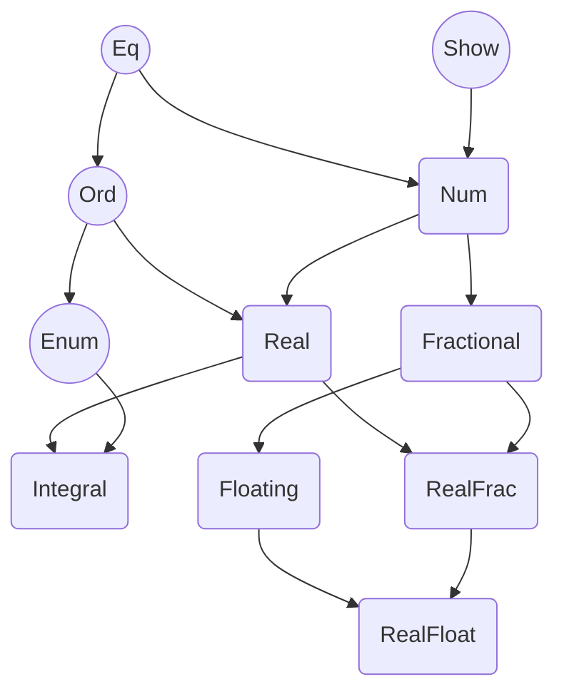

# Chapter 2 Type classes

Chapter converts:

* Exploiting type classes as tools for writing code that works for values of different typs

* Considering type classes as a concept applicable to many types

* Using basic type classes defined in the standard library

* Abstracting computations via type classes

----

:+1: __`Type classes`__ are usually considered most prominent feature:

* With respect to some type variable

* Contains a collection of methods, given by signatures

* Can define as many instances or implementation as we needed

:+1: Writing functions with respect to a type class, as opposed to using concrete types, allows to be more general. This makes type classes especially useful for _libraries_.

## 2.1 Manipulating a radar antenna with type classes

:+1: It is useful to think about type classes as abstract concepts

:+1: An experienced Haskeller often looks for a type class first and then start coding.

### 2.1.1 The problem at hand

**Example ch02/radar**

A radar antenna state and behavior:

```haskell
data Direction = North | East | South | West
data Turn = TNone | TLeft | TRight | TAround

rotate :: Turn -> Direction -> Direction
orient :: Direction -> Direction -> Turn
```

### 2.1.2 Rotating a radar antenna with Eq, Enum and Bounded

:crystal_ball: The concept of `enumerating` data constructors expressed with the __`Enum`__ type class.

`Enum` has eight methods:

```haskell
class Enum a where
    succ :: a -> a
    pred :: a -> a

    toEnum   :: Int -> a
    fromEnum :: a -> Int

    enumFrom        :: a -> [a]
    enumFromThen    :: a -> a -> [a]
    enumFromTo      :: a -> a -> [a]
    enumFromThenTo  :: a -> a -> a -> [a]
```

:point_right: If it makes sense to enumerate elements of a type one by one, then we should implement `Enum`.


:crystal_ball: __`Bounded`__ is used to specify `minimum` and `maximum` bounds among all the data constructors.

`Bounded` class defines two methods:

```haskell
class Bounded a where
    minBound :: a
    maxBound :: a
```

:point_right: If a data type supports the idea of `minimum` and `maximum`, then we define the `Bounded` instance.


:crystal_ball: __`Eq`__ to tell whether two values are equal.

`Eq` type class with two methods: `(==)` and `(/=)`

```haskell
class Eq a where
    (==), (/=) :: a -> a -> Bool
```

:point_right: If the value of a type can be checked for equality, we define an instance of the `Eq` type class.

> :exclamation: GHCi provides two commands to get information about type classes: `:info` and `:doc`

#### Deriving Instances

* We can derive instances automatically.

* We can implement those instance manually.

```haskell
data Direction = North | East | South | West
    deriving (Eq, Enum, Bounded, Show)

data Turn = TNone | TLeft | TRight | TAround
    deriving (Eq, Enum, Bounded, Show)

> fromEnum West
-- 3

> toEnum 3 :: Direction
-- West
```

#### Building Abstractions Upon Abstractions

Class defines two methods with default implementations:

```haskell
class (Eq a, Enum a, Bounded a) => CyclicEnum a where
    cpred :: a -> a
    cpred d
        | d == minBound = maxBound
        | otherwise     = pred d
    
    csucc :: a -> a
    csucc d
        | d == maxBound = minBound
        | otherwise     = succ d
```

To allow use of any typeclass in `deriving` class, we need to use __`DeriveAnyClass`__:

```haskell
{-# LANGUAGE DeriveAnyClass #-}

data Direction = North | East | South | West
    deriving (Eq, Enum, Bounded, CyclicEnum, Show)
```

The above code is equivalent to:

```haskell
data Direction = North | East | South | West
    deriving (Eq, Enum, Bounded, Show)

instance CyclicEnum Direction
```

#### Implementing Radar Manipulation Functions

As the `Turn` is a instance of `Enum`, so the list of `Turn` can be shorten:

```haskell
[TNone, TLeft, TRight, TAround]
-- equivalent to:
[TNone..TAround]
```

As `Turn` data type also is an instance of `Bounded`, so it can be expressed as:

```haskell
[minBound..maxBound]
```

This behavior can be generalized to a generic function:

```haskell
every :: (Enum a, Bounded a) => [a]
every = enumFrom minBound
```

> Important list processing functions:
>
> ```haskell
> foldl :: (b -> a -> b) -> b -> [a] -> b
>
> scanl :: (b -> a -> b) -> b -> [a] -> [b]
>
> zipWith :: (a -> b -> c) -> [a] -> [b] -> [c]
> ```

### 2.1.3 Combining turns with Semigroup and Monoid

#### Semigroup

Defined in __Data.Semigroup__

```haskell
class Semigroup a where
    (<>) :: a -> a -> a
```

#### Monoid

```haskell
class Semigroup a => Monoid a where
    mempty :: a
    mappend :: a -> a -> a
    mconcat :: [a] -> a
```

`mempty` so-called `neutral` element, as it is expected to satisfy the _`monoid laws`_:

```haskell
mempty <> a = a
a <> mepmty = a
```

`mconcat` function return `mempty` if the given list is empty and applies an operation over all the elements from left to right otherwise.

`sconcat` function is similar but there is __NO neutral__ element in `Semigroup` so it cannot return something meaningful in the case of an empty list.

```haskell
sconcat :: Semigroup a => NonEmpty a -> a

> import Data.List.NonEmpty

data NonEmpty a = a :| [a]

> xyz = sconcat ("x" :| ["y", "z"])
-- "xyz"
```

After `Turn` implement `Semigroup` and `Monoid` type class, the following code are equivalent, and the later one only need to `rotate` once:

```haskell
rotateMany :: Direction -> [Turn] -> Direction
rotateMany = foldl (flip rotate) 

rotateMany :: Direction -> [Turn] -> Direction
rotateMany dir ts = rotate (mconcat ts)
```

#### :exclamation: __OverloadedStrings__ GHC Extension

```haskell
> :t "Hello"
-- "Hello" :: [Char]

> :set -XOverloadedStrings
> :t "Hello"
-- "Hello" :: Data.String.IsString p => p
```

The `IsString` type class defines only one method: `fromString`

```haskell
class Data.String.IsString a where
  Data.String.fromString :: String -> a
```

:mage: The only thing the extension `OverloadedStrings` is responsible for is replacing every __string literal__ in the source code with a call to the `fromString` method on that literal.

:point_right: To disable the `OverloadedStrings` in GHCi:

```haskell
> :set -XNoOverloadedStrings
```

### 2.1.4 Printing and reading data with _Show_ and _Read_

#### Standalone Deriving

Change the data type declaration by writing a __standalone deriving clause__:

1. This requires the __StandaloneDeriving__ GHC extension

2. Add the standard alone deriving clause, for example:

```haskell
deriving instance Read Direction
deriving instance Read Turn
```

#### Make custom type work with `fmt`

To use `fmt` with user-defined types, we have to implement `Buildable` type class

```haskell
class Buildable p where build :: p -> Builder

instance Buildable Direction where
    build North = "N"
    build East  = "E"
    ...

instance Buildable Turn where
    build TNone = "--"
    build TLeft = "<-"
    ...

> fmtLn $ "Final direction: " +|| rotateMany dir turns ||+ ""
```

The `fmt` function is to print the given value in the context:

```haskell
fmt :: Fmt.Internal.Core.FromBuilder b => Builder -> b

class Fmt.Internal.Core.FromBuilder a where
    Fmt.Internal.Core.fromBuilder :: Builder -> a
```

* The `IO ()` instance of `FromBuilder` prints the given value

* The `Text` instance of `FromBuilder`, so it can be used to return a `Text` value as well.

> __Polymorphic Values__: The values of `C a => a` type are called polymorphic, because they can be used in many forms, depending on the required type.
> Example:
> Numeric values polymorphically: `Num a => a`
> `String` literals become polymorphic: `IsString s => s`
> Builder: `FromBuilder b => b`

### 2.1.5 Testing functions with `Ord` and `Random`

**Example: tests/radar**

> The test suite is a separate program, it can be run by:
> `cabal test radar-text`

#### Order

Order depends on equality:

```haskell
class Eq a => Ord a where
    compare :: a -> a -> Ordering
    (<)  :: a -> a -> Bool
    (<=) :: a -> a -> Bool
    ...
    {-# MINIMAL compare | (<=) #-}
```

#### Randomness

Several parts of the random-numbers interface are available to Haskell programmer:

* Pure random-number generators

* Stateful random-number generators

* Infrastructure for drawing random values of various types

:package: `random` package gives us:

* :abacus: __System.Random__ module - the __`RandomGen`__ type class for describing pure random-number generators.

```haskell
class RandomGen g where
    next      :: g -> (Int, g)
    ...
    genWord64 :: g -> (Word64, g)
    ...
    genRange  :: g -> (Int, Int)
    split     :: g -> (g, g)
```

* :abacus: __System.Random.Stateful__ module - the __`StatefulGen`__ type class for describing stateful random-number generators.

```haskell
class Monad m => StatefulGen g m where
    ...
    uniformWord32 :: g -> m Word32
    ...
    uniformWord64 :: g -> m Word64
```

* :cherries: __`StdGen`__ type: a standard random-number generator, which implements the `RandomGen` type class. _a function that compute a random number from `StdGen` is a pure function._

* :cherries: There is also the `global` standard random-number generator available in the `IO` monad.

* :abacus: the __`Uniform`__ and __`UniformRange`__ type class for drawing a value from a whole domain or from a re

```haskell
class Uniform a where
    uniformM :: StatefulGen g m => g -> m a

class UniformRange a where
    uniformRM :: StatefulGen g m => (a, a) -> g -> m a
```

* :apple: The simplest way of generating random values of type `a` is to use one of the following `uniform` or `uniformR` function:

```haskell
uniform :: (RandomGen g, Uniform a) => g -> (a, g)

uniformR :: (RandomGen g, UniformRange a) => (a, a) -> g -> (a, g)
```

:handshake: the `uniformR` function takes a range in the form of `(lo, hi)` tuple values.

:exclamation: Note the `g` generator given and returned in the code, these functions are pure, so we need the resulting generator for creating the next random numbers.

:question: Where do we get the generator?

:crystal_ball: Option 1 : `IO` monad

```haskell
-- :earth_asia: The first two `get` and `set` the global random-number generator:
getStdGen :: IO StdGen
setStdGen :: StdGen -> IO ()

-- :earth_americas: This one gives us a generator and updates the global one at same time:
newStdGen :: IO StdGen

-- :earth_africa: This one is perfectly suitable to be used with both `uniform` and `uniformR` functions:
getStdRandom :: (StdGen -> (a, StdGen)) -> IO a

uniformIO :: Uniform a => IO a
uniformIO = getStdRandom uniform

uniformRIO :: UniformRange a => (a, a) -> IO a
uniformRIO range = getStdRandom $ uniformR range
-- uniformR :: (RandomGen g, UniformRange a) => (a, a) -> g -> (a, g)
-- uniformR range :: (RandomGen g, UniformRange a) =>     g -> (a, g)
-- getStdRandom   ::                                (StdGen -> (a, StdGen)) -> IO a
-- getStdRandom $ uniformR range :: IO a
```

:dancers: The standard generator is __splittable__, meaning that we can produce two generators from the one we have and use them independently.

:space_invader: The general scenario of using random numbers:

1. Acquire the random-number generator from operating system using `newStdGenIO`;

2. Use the generator, as long as we keep updating the generator every time we generate a random number.

#### Generating Random Directions and Turns

:exclamation: Note the `M` suffix: defined in `System.Random.Stateful` module and use the monadic interface more generally.

```haskell
instance UniformRange Turn where
    uniformRM (lo, hi) rng = do
        res <- uniformRM (fromEnum lo :: Int, fromEnum hi) rng
        pure $ toEnum res

instance Uniform Turn where
    uniformM rng = uniformRM (minBound, maxBound) rng
```

## 2.2 Issues with numbers and text


### 2.2.1 Numeric types and type classes

* `Int` and `Word` for fixed-precision integers

* `Integer` for arbitrary-precision integers

* `Float` and `Double` for floating-point numbers

* Import `Data.Ratio` module, we can use `Ratio a` and `Rational`, as `%` operator for representing fractions:

```haskell
> 1%4 + 1%4
> 1%2
```

* Import `Data.Complex` module, we can get type `Complex a` and use complex numbers

```haskell
> (0 :+ 1) + (0 :+ (-1))
> 0.0 :+ 0.0
```

Numeric type classes:

* Start with the most abstract type class `Num`

* Other type classes include:

  * `Integral` unifying operations for all integer types

  * `Real` for operations over real (non-complex) numbers

  * `Floating` for operations with floating-point numbers (`Float` and `Double`)

  * `Fractional` for everything that can be used with __division__

