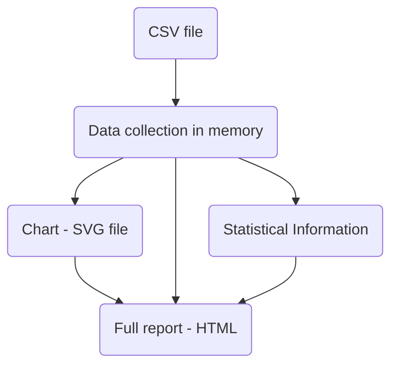

# Chapter 3 Developing an application: Stock quotes

Chapter covers:

* Designing a standalone multi-module program with dependencies

* Dealing with dates, text and command-line args

* Parsing CSV file and plotting charts

* Employing type classes


## 3.1 Setting the scene



What we should do in this project:

* Process command-line arguments

* Read quote data from a CSV file

* Compute statistics

* Plot charts

* Prepare reports on statistical info in text and HTML


## 3.2 Exploring design space

### :red_circle: Designing the user interface

* Mandatory arguments are `positional` (User had to specify them in positions)

* Program behavior can be tweaked with a set of options or flags beginning with a dash in any position.

```bash
# Usage: stock FILE [-n|--name Arg] [-c\--char] [--html FILE] [-s|--silent]
```

:tired_face: Manual Parsing Option: `getArgs` to traverse a list of command-line arguments and filling some `Map` or associate list

:smile: Haskell Libraries:

:package: `optparse-applicative` :white_check_mark:

:package: `cmdargs`

:exclamation: These haskell libs for dealing with command-line args are extremely powerful.

### :orange_circle: Dealing with Input Data

#### :moon: Dates and Times

:package: `time` package from Haskell is sophisticated enough to deal with all date related technicalities.

* `Day` type represents a date in the Gregorian calendar
* Different types for times and duration can be imported from `Data.Time` module of this package
* Other functions:
  * Constructing dates and time form integers
  * Parsing dates and times from strings
  * Formatting dates and times into strings
  * Getting the current date and time
  * manipulating dates and times

:yellow_circle: Parsing CSV Files

Option :one: To read the CSV, we could just use basic `Text` processing facilities as: `lines`, `splitOn` and `read` functions.

Hard part for manual processing: error processing

1. Naive implementation: :skull: _garbage in, garbage out_: any errors would result in an exception.

2. Deal with error: :superhero_man:
   * Ignore incorrect line or report them to user;
   * Interpolate missing values somehow using neighboring values;
   * Stop reading the file after encountering an error.

Option :two: To use some powerful libraries like `parsec`.

Option :three: To use some external package specifically for parsing CSV, like `cassava`:

* Implementing instances of the `FromField` type class;
* Work with `Vector` from `Data.Vector` module from `vector` package.

### :large_blue_circle: Formatting reports:

```haskell
minimumBy :: Foldable t => (a -> a -> Ordering) -> t a -> a
maximumBy :: Foldable t => (a -> a -> Ordering) -> t a -> a
        -- Defined in ‘Data.Foldable’

fixedF :: Real a => Int -> a -> Builder
        -- Defined in ‘Fmt.Internal.Numeric’

pretty :: (Buildable a, Fmt.Internal.Core.FromBuilder b) => a -> b
        -- Defined in ‘Fmt.Internal.Core’

ascii :: Foldable f => Colonnade Headed a String -> f a -> String
        -- Defined in ‘Colonnade’

headed :: c -> (a -> c) -> Colonnade Headed a c
        -- Defined in ‘Colonnade’

type Colonnade :: (* -> *) -> * -> * -> *
newtype Colonnade h a c
  = Colonnade.Encode.Colonnade {
      Colonnade.Encode.getColonnade :: Data.Vector.Vector (
          Colonnade.Encode.OneColonnade h a c)
    }

type Headed :: * -> *
newtype Headed a = Headed {getHeaded :: a}
        -- Defined in ‘Colonnade.Encode’
```

### :green_circle: Plotting charts:

```haskell
renderableToFile ::
  FileOptions -> FilePath -> Renderable a -> IO (PickFn a)
        -- Defined in ‘Graphics.Rendering.Chart.Backend.Diagrams’

type FileOptions :: *
data FileOptions
  = FileOptions {_fo_size :: (Double, Double),
                 _fo_format :: FileFormat,
                 _fo_fonts :: IO (FontSelector Double)}
        -- Defined in ‘Graphics.Rendering.Chart.Backend.Diagrams’

type ToRenderable :: * -> Constraint
class ToRenderable a where
  toRenderable :: a -> Renderable ()
  {-# MINIMAL toRenderable #-}

type Renderable :: * -> *
data Renderable a
  = Renderable {minsize :: BackendProgram RectSize,
                render :: RectSize -> BackendProgram (PickFn a)}
        -- Defined in ‘Graphics.Rendering.Chart.Renderable’

type PickFn :: * -> *
type PickFn a = Point -> Maybe a
        -- Defined in ‘Graphics.Rendering.Chart.Renderable’

type StackedLayouts :: * -> *
data StackedLayouts x
  = StackedLayouts {_slayouts_layouts :: [StackedLayout x],
                    _slayouts_compress_legend :: Bool}
        -- Defined in ‘Graphics.Rendering.Chart.Layout’

type Layout :: * -> * -> *
data Layout x y
  = Layout {_layout_background :: FillStyle,
            _layout_plot_background :: Maybe FillStyle,
            _layout_title :: String,
            _layout_title_style :: FontStyle,
            _layout_x_axis :: LayoutAxis x,
            _layout_top_axis_visibility :: AxisVisibility,
            _layout_bottom_axis_visibility :: AxisVisibility,
            _layout_y_axis :: LayoutAxis y,
            _layout_left_axis_visibility :: AxisVisibility,
            _layout_right_axis_visibility :: AxisVisibility,
            _layout_plots :: [Plot x y],
            _layout_legend :: Maybe LegendStyle,
            _layout_margin :: Double,
            _layout_grid_last :: Bool}
        -- Defined in ‘Graphics.Rendering.Chart.Layout’

type StackedLayout :: * -> *
data StackedLayout x
  = forall y. Ord y => StackedLayout (Layout x y)
  | forall yl yr.
    (Ord yl, Ord yr) =>
    StackedLayoutLR (LayoutLR x yl yr)


type Candle :: * -> * -> *
data Candle x y
  = Candle {candle_x :: x,
            candle_low :: y,
            candle_open :: y,
            candle_mid :: y,
            candle_close :: y,
            candle_high :: y}
        -- Defined in ‘Graphics.Rendering.Chart.Plot.Candle’

type ToPlot :: (* -> * -> *) -> Constraint
class ToPlot a where
  toPlot :: a x y -> Plot x y

type Plot :: * -> * -> *
data Plot x y
  = Plot {_plot_render :: PointMapFn x y -> BackendProgram (),
          _plot_legend :: [(String, Rect -> BackendProgram ())],
          _plot_all_points :: ([x], [y])}
        -- Defined in ‘Graphics.Rendering.Chart.Plot.Types’

bars :: (PlotValue x, BarsPlotValue y) =>
    [String] -> [(x, [y])] -> EC l (PlotBars x y)
        -- Defined in ‘Graphics.Rendering.Chart.Easy’

type EC l a =
  Control.Monad.Trans.State.Lazy.StateT l
    (Control.Monad.Trans.State.Lazy.State CState) a
        -- Defined in ‘Graphics.Rendering.Chart.State’


type PlotCandle :: * -> * -> *
data PlotCandle x y
  = PlotCandle {_plot_candle_title :: String,
                _plot_candle_line_style :: LineStyle,
                _plot_candle_fill :: Bool,
                _plot_candle_rise_fill_style :: FillStyle,
                _plot_candle_fall_fill_style :: FillStyle,
                _plot_candle_tick_length :: Double,
                _plot_candle_width :: Double,
                _plot_candle_centre :: Double,
                _plot_candle_values :: [Candle x y]}
        -- Defined in ‘Graphics.Rendering.Chart.Plot.Candle’
instance Default (PlotCandle x y)
  -- Defined in ‘Graphics.Rendering.Chart.Plot.Candle’
instance ToPlot PlotCandle
  -- Defined in ‘Graphics.Rendering.Chart.Plot.Candle’


type PlotLines :: * -> * -> *
data PlotLines x y
  = PlotLines {_plot_lines_title :: String,
               _plot_lines_style :: LineStyle,
               _plot_lines_values :: [[(x, y)]],
               _plot_lines_limit_values :: [[(Limit x, Limit y)]]}
        -- Defined in ‘Graphics.Rendering.Chart.Plot.Lines’
instance Default (PlotLines x y)
  -- Defined in ‘Graphics.Rendering.Chart.Plot.Lines’
instance ToPlot PlotLines
  -- Defined in ‘Graphics.Rendering.Chart.Plot.Lines’


type PlotBars :: * -> * -> *
data PlotBars x y
  = PlotBars {_plot_bars_style :: PlotBarsStyle,
              _plot_bars_item_styles :: [(FillStyle, Maybe LineStyle)],
              _plot_bars_titles :: [String],
              _plot_bars_spacing :: PlotBarsSpacing,
              _plot_bars_alignment :: PlotBarsAlignment,
              _plot_bars_reference :: y,
              _plot_bars_singleton_width :: Double,
              _plot_bars_values :: [(x, [y])]}
        -- Defined in ‘Graphics.Rendering.Chart.Plot.Bars’
instance BarsPlotValue y => Default (PlotBars x y)
  -- Defined in ‘Graphics.Rendering.Chart.Plot.Bars’


type LineStyle :: *
data LineStyle
  = LineStyle {_line_width :: Double,
               _line_color :: AlphaColour Double,
               _line_dashes :: [Double],
               _line_cap :: LineCap,
               _line_join :: LineJoin}
        -- Defined in ‘Graphics.Rendering.Chart.Backend.Types’
instance Eq LineStyle
  -- Defined in ‘Graphics.Rendering.Chart.Backend.Types’
instance Show LineStyle
  -- Defined in ‘Graphics.Rendering.Chart.Backend.Types’
instance Default LineStyle
  -- Defined in ‘Graphics.Rendering.Chart.Backend.Types’


type Default :: * -> Constraint
class Default a where
  def :: a
  default def :: (GHC.Generics.Generic a,
                  Data.Default.Class.GDefault (GHC.Generics.Rep a)) =>
                 a
        -- Defined in ‘data-default-class-0.1.2.0:Data.Default.Class’
```
