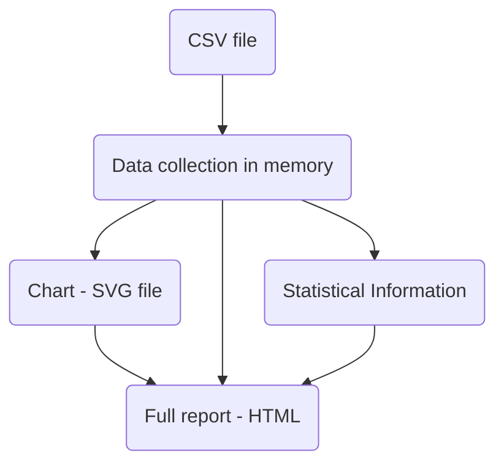
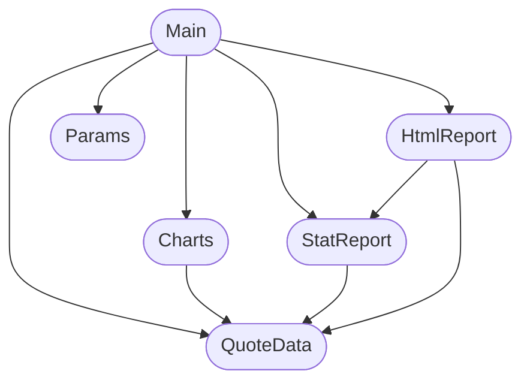

# Chapter 3 Developing an application: Stock quotes

Chapter covers:

* Designing a standalone multi-module program with dependencies

* Dealing with dates, text and command-line args

* Parsing CSV file and plotting charts

* Employing type classes

## 3.1 Setting the scene

What we should do in this project:

* Process command-line arguments

* Read quote data from a CSV file

* Compute statistics

* Plot charts

* Prepare reports on statistical info in text and HTML

