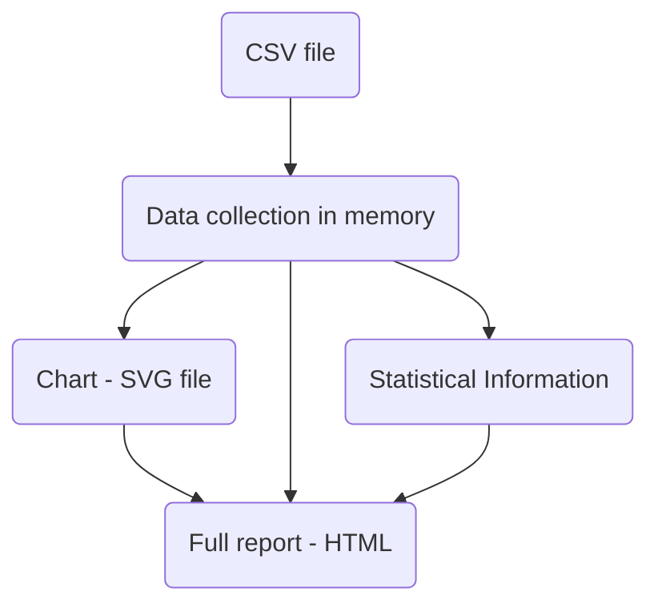

# Chapter 3 Developing an application: Stock quotes

Chapter covers:

* Designing a standalone multi-module program with dependencies

* Dealing with dates, text and command-line args

* Parsing CSV file and plotting charts

* Employing type classes


## 3.1 Setting the scene



What we should do in this project:

* Process command-line arguments

* Read quote data from a CSV file

* Compute statistics

* Plot charts

* Prepare reports on statistical info in text and HTML


## 3.2 Exploring design space

### :red_circle: Designing the user interface

* Mandatory arguments are `positional` (User had to specify them in positions)

* Program behavior can be tweaked with a set of options or flags beginning with a dash in any position.

```bash
# Usage: stock FILE [-n|--name Arg] [-c\--char] [--html FILE] [-s|--silent]
```

:tired_face: Manual Parsing Option: `getArgs` to traverse a list of command-line arguments and filling some `Map` or associate list

:smile: Haskell Libraries:

:package: `optparse-applicative` :white_check_mark:

:package: `cmdargs`

:exclamation: These haskell libs for dealing with command-line args are extremely powerful.

### :orange_circle: Dealing with Input Data

#### :moon: Dates and Times

:package: `time` package from Haskell is sophisticated enough to deal with all date related technicalities.

* `Day` type represents a date in the Gregorian calendar
* Different types for times and duration can be imported from `Data.Time` module of this package
* Other functions:
  * Constructing dates and time form integers
  * Parsing dates and times from strings
  * Formatting dates and times into strings
  * Getting the current date and time
  * manipulating dates and times

