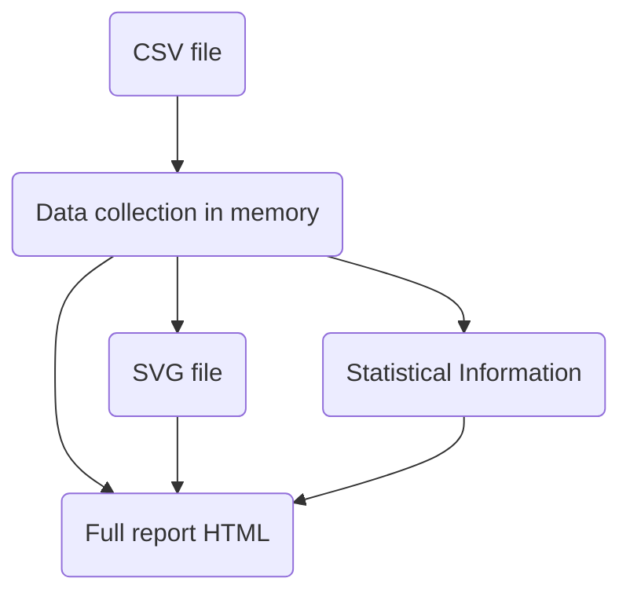

# Chapter 3 Developing an application: Stock quotes

Chapter covers:

* Designing a standalone multi-module program with dependencies

* Dealing with dates, text and command-line args

* Parsing CSV file and plotting charts

* Employing type classes

## 3.1 Setting the scene

